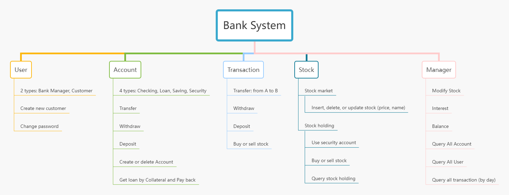

# Team
|name|work|ID|Email|
|----|----|----|----|
|Zhihao Gu|GUI, Controller, Model, Documentation|U55787297|zhihao97@bu.edu|
|Pengchao Yuan|GUI, Controller, Model, DB, Documentation|U50962567|yuanpc@bu.edu|
|Huiwen He|GUI|U96391336|huiwenhe@bu.edu|

# Run in the src folder
- Execution
  java Main.java
# File structure
Refer to tree.txt

# Design
Refer to Online Bank Design Documentation.pdf

## MVC pattern
The project is organized by MVC pattern.  
V: View. All things about GUI.  
M: Model. All things about DB.  
C: Controller. Connect the M and V, which means all the logic things are there.

>example:  
User make a transfer from bank account A to bank account B.  
In V, user do a transfer action. Then, the transfer amount, account id and so on will be passed to C.  
In C, it will do some check, like whether the user has enough money. And then, use M to change all related data in A and
B. Add a transaction. 
In M, will use SQLite to update all data.

>Note:  
You should use interface to contract your method.

## Singleton Pattern  
For DAO.java. Double-checked locking  
Reason: Connection with database is expensive. There is no need to create a new connection.

# Features

# Scalability and extensibility
User is abstract class. Can create new type of user by extend it.  
Account is abstract class.  Can create new type of account by extend it.

# Future

Allow multiple users use the 